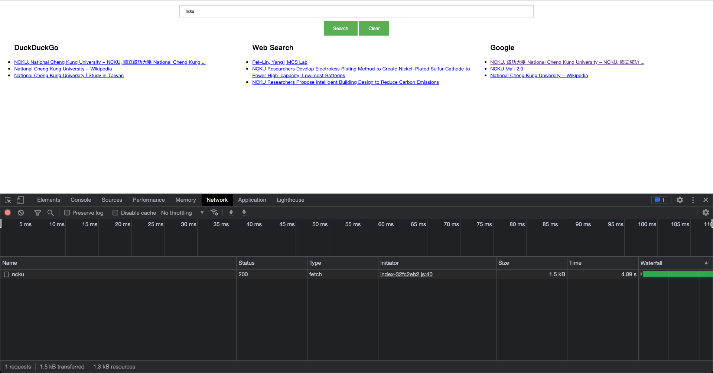
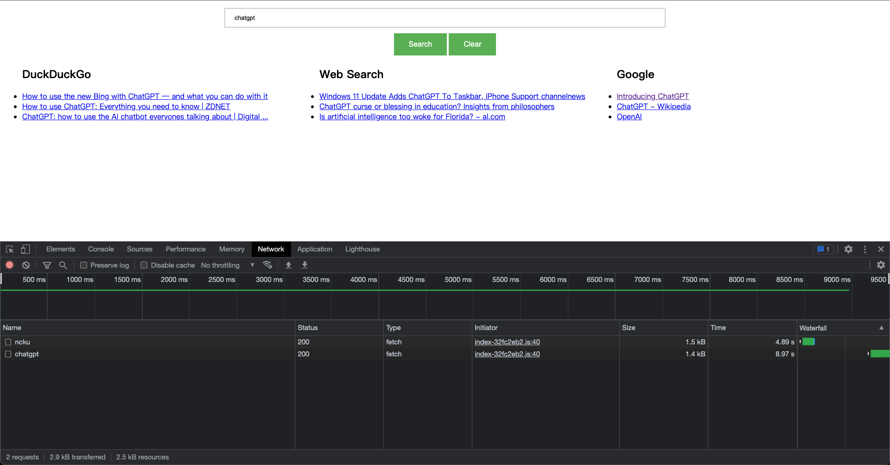
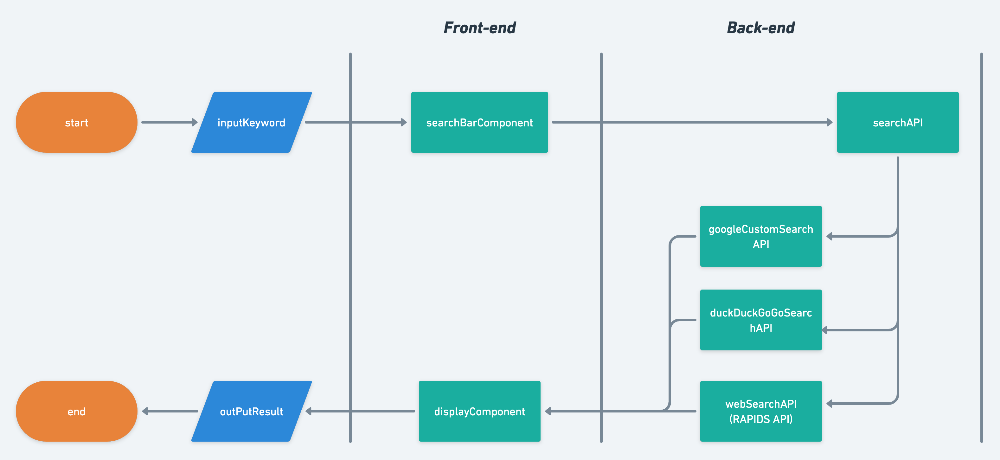

# Meta Search Engine
Meta-search engine: dispatch the user query to several search engines at the same time, collect and merge the results into one list for the user.

## Project Result
### [Demo](http://nero-buslab-docker-desktop.dog-bangus.ts.net:5173/) 

## Project article
[【串串 API】搞一個整合式搜尋引擎 — — 使用 FastAPI、React 、Docker 和 RapidAPI 實作 Meta-Search Engine](https://medium.com/@NeroHin/%E4%B8%B2%E4%B8%B2-api-%E6%90%9E%E4%B8%80%E5%80%8B%E6%95%B4%E5%90%88%E5%BC%8F%E6%90%9C%E5%B0%8B%E5%BC%95%E6%93%8E-%E4%BD%BF%E7%94%A8-fastapi-react-docker-%E5%92%8C-rapidapi-%E5%AF%A6%E4%BD%9C-meta-search-engine-543bbbc79f5b)
## Scope
Homework: Develop a meta-search engine that responds to user queries with combined search results from a few search engines.

# HW requirements

- Using input component to get  query
 
- three search engines: Google, Web Search, DuckDuckGo

## Tech stack

1. API Framework: FastAPI
2. Search Engine: Google CSE, WebSearch(RAPID), DuckDuckGo
3. Frontend: React

## Project architecture

# How to run
1. Clone the repo
2. cd to the repo `cd meta-search`
3. run `docker-compose up`
